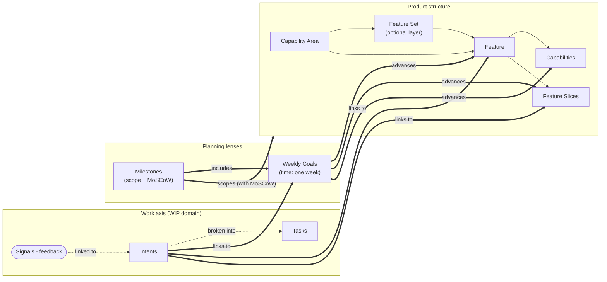
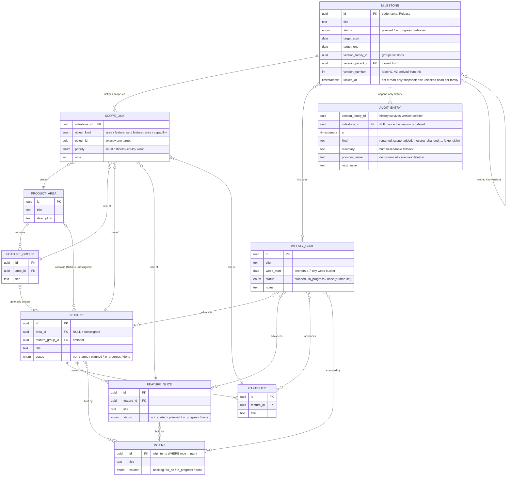

# Roadmap — Data Model

Database schema for the Roadmap section of Signal, derived from the prototype's in-memory model
(`lib/data.ts` / `lib/store.tsx`). UI names are used throughout; code names noted where they differ.

---

## 1. The big picture

Two axes joined by links — not one pyramid. **Product structure** describes what the product is
made of; the **work axis** describes what we're doing and why. **Weekly Goals** and **Milestones**
are planning lenses that point into both. Feedback never touches the roadmap directly — **intents
are the only bridge**.

---

## 2. Entity–relationship diagram

---

## 3. Entities at a glance

| Entity | UI name | Code name | What it is |
|---|---|---|---|
| `product_areas` | Capability Area | `ProductArea` | Top of the structure tree |
| `feature_groups` | Feature Set | `FeatureGroup` | Optional middle layer inside an area |
| `features` | Feature | `Feature` | Core structure unit; can be **unassigned** (no area) when created ad-hoc from a goal card |
| `product_capabilities` | Capability | `ProductCapability` | What a feature can do |
| `feature_slices` | Feature Slice | `FeatureSlice` | Deliverable vertical cut of a feature |
| `weekly_goals` | Weekly Goal | `WeeklyGoal` | Week-scoped planning unit; status is human-set, never derived |
| `milestones` | Milestone | `Release` | Pure scope package — owns nothing, points at goals + structure |
| `milestone_audit_entries` | Change history | `MilestoneAuditEntry` | Append-only log of every milestone mutation |
| `wip_items` (bridge) | Intent / Task | `Wip` | Owned by the WIP domain; roadmap only links to `type = 'intent'` |

## 4. Relationships (the join tables)

Everything connecting the axes is **many-to-many**. In the prototype these were ID arrays stored
on one side; in the database each becomes a join table. Two of them carry payload — that's why
they exist as first-class tables rather than plain pairs:

| Link | Cardinality | Payload on the link |
|---|---|---|
| Goal ↔ Feature / Slice / Capability | n : m | — |
| Goal ↔ Intent | n : m | — |
| Feature ↔ Intent, Slice ↔ Intent | n : m | — |
| Milestone ↔ Goal | n : m | — |
| **Milestone ↔ structure object** (`milestone_scope_links`) | n : m, polymorphic over 5 kinds | **MoSCoW priority + note** — the same feature can be *must* in one milestone and *could* in another |
| Intent → Capability | *derived, not stored* | Computed transitively through the intent's goals |

## 5. Design decisions worth defending in a review

1. **Arrays → join tables.** The prototype stores links as ID arrays on the container and scans
   for reverse lookups. Join tables give both directions, referential integrity, and indexes.
2. **MoSCoW lives on the milestone↔object link, not on the object.** This is the prototype's
   most important rule: priority is *per milestone*, deliberately non-cascading to children.
3. **Milestone versioning = self-reference + family key.** Cloning (from *any* version, snapshots
   included) creates the next version in the same `version_family_id`; the current head gets
   `locked_at` stamped. Exactly one unlocked, editable head per family — enforced by a unique
   index. Deleting the head hands editability back to the previous version.
4. **Audit log is append-only and denormalized.** Entries store object *labels* and old/new
   *values as text*, and are anchored to the version *family* — so history survives deletion of
   the objects it mentions and even of the milestone version itself.
5. **Unassigned features are `area_id NULL`** (prototype used an empty string) — supports the
   "type a feature name on a goal card, organize it later" flow.
6. **Signals stay out of the roadmap schema.** The only doorway is `wip_items` of type `intent`;
   link tables enforce that with a composite foreign key on `(id, type)`.

---

*Full PostgreSQL DDL: [`roadmap-db-schema.sql`](roadmap-db-schema.sql). A browser-presentable
version of this document: [`roadmap-schema.html`](roadmap-schema.html).*
